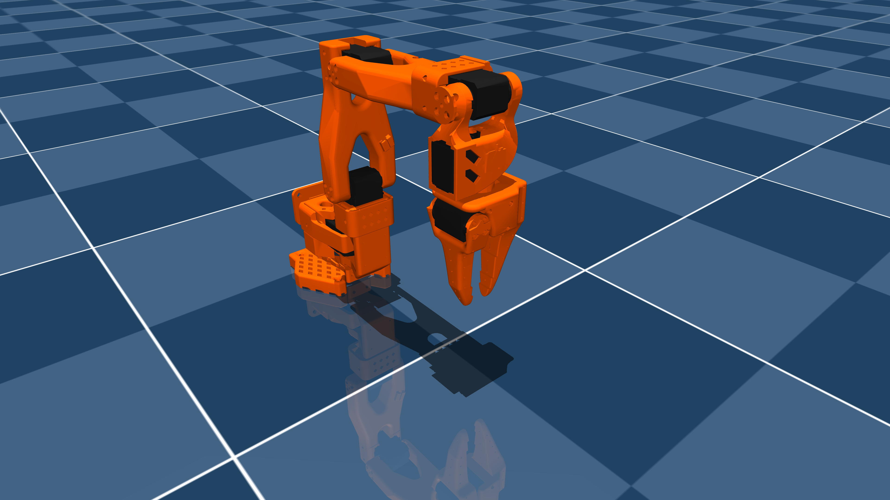

# Standard Open Arm-100 5DOF - Version 1.3 (MJCF)

> [!IMPORTANT]
> Requires MuJoCo 3.1.6 or later.

## Overview

This package contains a simplified robot description (MJCF) of the [Standard Open Arm-100](https://github.com/TheRobotStudio/SO-ARM100/tree/main) developed by [The Robot Studio](https://www.therobotstudio.com/). It is derived from the [publicly available URDF description](https://github.com/TheRobotStudio/SO-ARM100/blob/4e9c5588d8a8415b6a6c2142a0ce8c32207cf3e9/URDF/SO_5DOF_ARM100_8j_URDF.SLDASM/urdf/SO_5DOF_ARM100_8j_URDF.SLDASM.urdf).

<p float="left">
  
</p>

## URDF → MJCF derivation steps

1. Added `<mujoco><compiler discardvisual="false" strippath="false"/></mujoco>` to the URDF’s `<robot>` element to preserve visual geometries.
2. Loaded the URDF into MuJoCo and saved it as a corresponding MJCF.
3. Manually edited the MJCF to extract shared properties into the `<default>` section.
4. Edited original meshes: extracted servos into separate files, manually created convex collision meshes for the gripper jaws.
5. Added extra box-shaped collision geoms to the gripper for additional contact points.
6. Added an `exclude` clause to prevent collisions between `Base` and `Rotation_Pitch`.
7. Added approximate joint limits.
8. Added position-controlled actuators.
9. Added `impratio="10"` and `cone="elliptic"` attributes for improved no-slip behavior.
10. Created `scene.xml` to include the robot, along with a textured ground plane, skybox, and haze.

## Visualising the model

To simply open MuJoCo’s viewer and watch the robot idle in its *home* pose:

```bash
pip install -r requirements.txt  # certifique-se de que o MuJoCo esteja instalado

python manual_control.py
```

Close the window (or press *Esc* inside the viewer) to terminate.

## Using the environment in reinforcement learning

If you prefer programmatic access you can import

```python
from so_arm_env import SoArm100Env

env = SoArm100Env(render_mode=None)  # Gymnasium compatible
obs, _ = env.reset()
for _ in range(1000):
    action = env.action_space.sample()
    obs, reward, terminated, truncated, info = env.step(action)
    if terminated or truncated:
        break
env.close()
```


## License

This model is released under an [Apache-2.0 License](LICENSE).
# lerobot-mujoco
